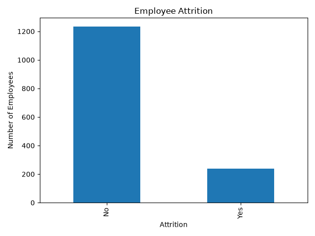
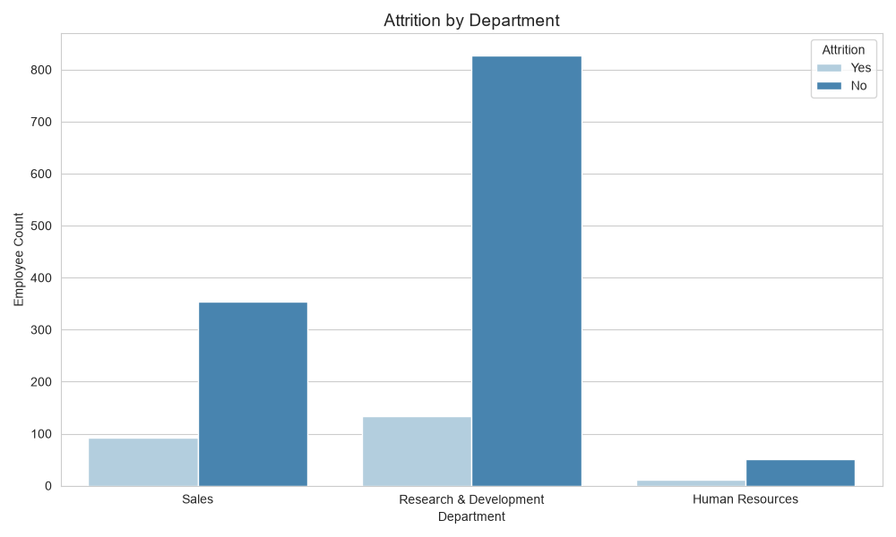
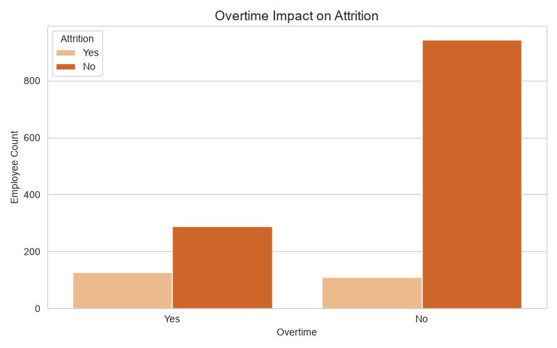
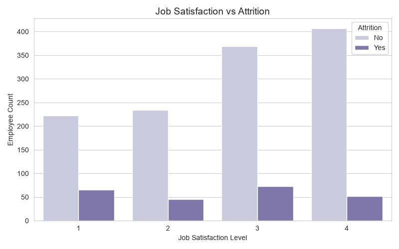
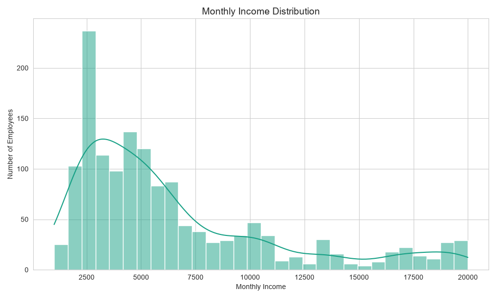
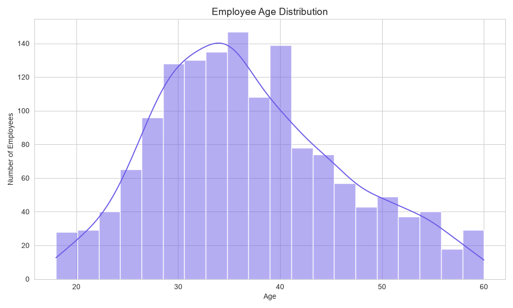

# HR Analytics Dashboard

## Project Overview 
This project analyzes employee data to understand workforce trends, employee attrition, job satisfaction, compensation patterns, and factors affecting employee retention.
The analysis was performed using Python, Pandas, Matplotlib, and Seaborn.

## Technologies Used
Python
Pandas
NumPy
Matplotlib
Seaborn
Jupyter Notebook
Git & GitHub

## Dataset Summary
| Metric                 | Value    |
| ---------------------- | -------- |
| Total Employees        | 1470     |
| Attrition Rate         | 16.12%   |
| Average Monthly Income | $6502.93 |

## Analysis Performed
Employee Attrition Analysis
Department-wise Attrition Analysis
Overtime Impact Analysis
Job Satisfaction Analysis
Monthly Income Analysis
Employee Age Distribution Analysis

## Visualizations

### Employee Attrition Distribution

### Department-wise Attrition

### Overtime Impact on Attrition

### Job Satisfaction vs Attrition

### Monthly Income Distribution

### Employee Age Distribution

## Key Insights
-The overall employee attrition rate is 16.12%.
-Overtime appears to be associated with higher employee attrition.
-Attrition patterns vary across departments.
-Lower job satisfaction is linked to increased employee turnover.
-Compensation and employee age may influence retention trends.

## Business Recommendations
1. Monitor employees working frequent overtime.
2. Improve employee engagement and satisfaction programs.
3. Develop retention strategies for high-attrition departments.
4. Review compensation structures for employee groups at risk of leaving.
5. Use workforce analytics to support talent retention initiatives.

## Author

Tanvi Thorat
B.Sc. Data Science & Big Data Analytics
Aspiring Data Analyst
